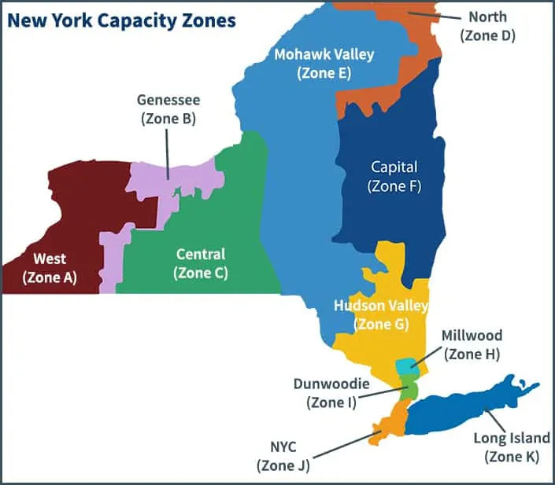

# Exploring Signal Processing Techniques with WaveletComp in R

## Author: [Daniel Pellegrino](https://danieljpellegrino.com/)

## Overview

This repository contains the code and data for the research project that I am conducting in Spring 2024.
The project is focused on exploring signal processing techniques with WaveletComp in R. The repository contains the following files:

## Research Methodology

To perform this research, follow these steps:

1. Install the WaveletComp and reticulate package by running the following code in R:

```{r}
install.packages("WaveletComp")
install.packages("reticulate")
# Then select a CRAN mirror.
```

2. Sector off each of NYISO's Capacity Zones

<p align="center">
  
  <p align="center">
    <a href="https://bestpracticeenergy.com/2020/04/02/new-york-electricity-supply-price-components/">
        Source:
    </a>
    bestpracticeenergy.com
  </p>
</p>

&nbsp;&nbsp;&nbsp;&nbsp;&nbsp;&nbsp;_Currently we're focusing on:_

- **A** _West_
- **C** _Central_
- **E** _Mohawk Valley_
- **K** _Long Island_

3. Zoom in on each specific sector from the following sources:

- **[Copernicus: CMIP5](https://cds.climate.copernicus.eu/cdsapp#!/dataset/projections-cmip5-monthly-single-levels?tab=form) > (Climate Model Intercomparison Project) Monthly Data on Single Levels**
- **[PCMDI](https://pcmdi.llnl.gov/CMIP6/) > (Project for Climate Model Diagnosis & Intercomparison): CMIP6 - Coupled Model Intercomparison Project Phase 6**
- **[NASA GES DISC](https://disc.gsfc.nasa.gov/) > (Goddard Earth Sciences Data and Information Services Center)**

4. Using the `WaveletComp` package, create a timeline using each section. Similiar to the following:
<p align="center">
  
  <p align="center">
    <a href="http://www.hs-stat.com/projects/WaveletComp/WaveletComp_guided_tour.pdf/">
        Source:
    </a>
    WaveletComp 1.1: A guided tour through the R package <i>Pg. 13</i>
  </p>
</p>
&nbsp;&nbsp;&nbsp;&nbsp;&nbsp;&nbsp;This example is done with the following R code.

```{r}
installed.packages("WaveletComp")
library("WaveletComp")
citation("WaveletComp")

x = periodic.series(start.period = 50, length = 1000)
x = x + 0.2*rnorm(1000) # add some noise

my.data <- data.frame(x = x)
```

# Taken from page 10 in https://cran.r-project.org/web/packages/WaveletComp/WaveletComp.pdf

matplot(my.data, type = "l", lty = 1, xaxs = "i", col = 1:2,
xlab = "years", ylab = "years",
main = "[Enter Renewable Energy Source] Production in the [NYISO Zone]",
sub = "sub")

## Layout

1. `README.md`: A markdown file that provides a brief overview of the research project.
2. `code/`: A directory that contains the R code used in the project.
3. `data/`: A directory that contains the data used in the project.
4. `output/`: A directory that contains the output generated from the R code.
5. `manuscript/`: A directory that contains the manuscript for the research project.

## Code

The `code/` directory contains the R code used in the project. The code is organized into the following files:

1. `waveletcomp_analysis.R`: An R script that contains the code for the signal processing analysis using the WaveletComp package.
2. `plotting.R`: An R script that contains the code for generating plots from the analysis.

## Data

The `data/` directory contains the data used in the project. The data is organized into the following files:

1. `signal_data.csv`: A CSV file containing the raw signal data used in the analysis.

## Output

The `output/` directory contains the output generated from the R code.

## Manuscript

The `manuscript/` directory contains the manuscript for the research project. The manuscript is organized into the following files:

1. `manuscript.Rmd`: An R markdown file containing the text and code for the manuscript.
2. `manuscript.pdf`: A PDF file containing the compiled manuscript.

## Contact

For questions about this repository, please contact me at [contact@danieljpellegrino.com](contact@danieljpellegrino.com).

The project involves the following students: [Nicholas Rossi](https://github.com/NickRossi89)

```

```
